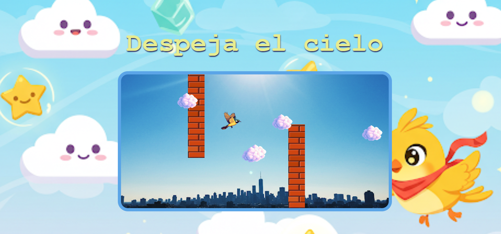

# 🦜 Despeja el cielo - Proyecto de POO 🕹️

## 📚 Descripción

Este es un proyecto creado para la clase de **Programación Orientada a Objetos (POO)**, basado en el famoso juego de **Flappy Bird**. El juego permite a un pájaro volar y esquivar bloques mientras recoge nubes. La programación se ha realizado utilizando **JavaScript** con una estructura orientada a objetos.

### 🌟 Características
- 🦅 **Personaje jugable**: Un pájaro que puede moverse de izquierda a derecha y saltar.
- 🧩 **Colisiones**: Detecta cuando el pájaro choca con bloques o recoge nubes.
- 🎮 **Interactividad**: Control de salto mediante teclas de flecha.
- 🏆 **Puntuación**: El jugador acumula puntos al recoger las nubes y gana cuando llega a 100 puntos.

## 💻 Tecnologías Utilizadas
- **HTML**: Estructura básica del juego.
- **CSS**: Estilos para crear el diseño visual y la interfaz.
- **JavaScript**: Lógica del juego usando Programación Orientada a Objetos (POO).

## 🚀 Instrucciones de Uso
1. Abre el archivo `index.html` en tu navegador web.
2. Usa las **flechas de dirección** para controlar el pájaro:
   - ↑ **Flecha arriba** para saltar.
   - ← **Flecha izquierda** y → **Flecha derecha** para mover el pájaro horizontalmente.
3. ¡Recoge todas las nubes para ganar y evita los bloques!

## 📝 Notas
- Si el pájaro choca con un bloque, perderás y el juego se reinicia.
- Si el pájaro consigue 100 puntos al recoger las nubes, ganarás el juego.

---
📫 Cómo contactarme

- Correo: [[cuyssi@hotmail.com](mailto:cuyssi@hotmail.com)]
- LinkedIn: [Ana] ([https://www.linkedin.com/in/ana-castro-a476b8346/](https://www.linkedin.com/in/ana-castro-a476b8346/))
---

Juega y disfruta! 
Gracias por ver mi perfil 😉
https://cuyssi.github.io/proyecto_juego_poo/

